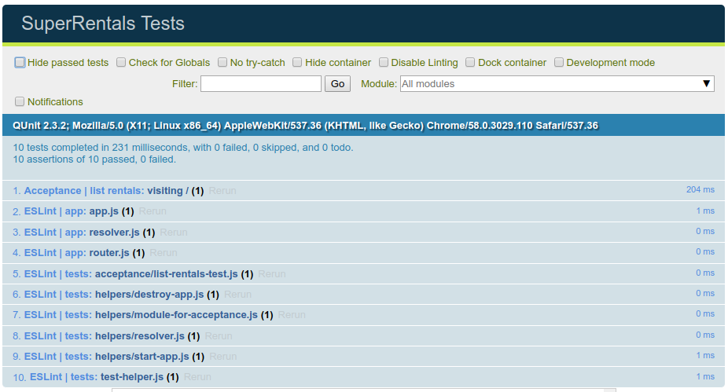
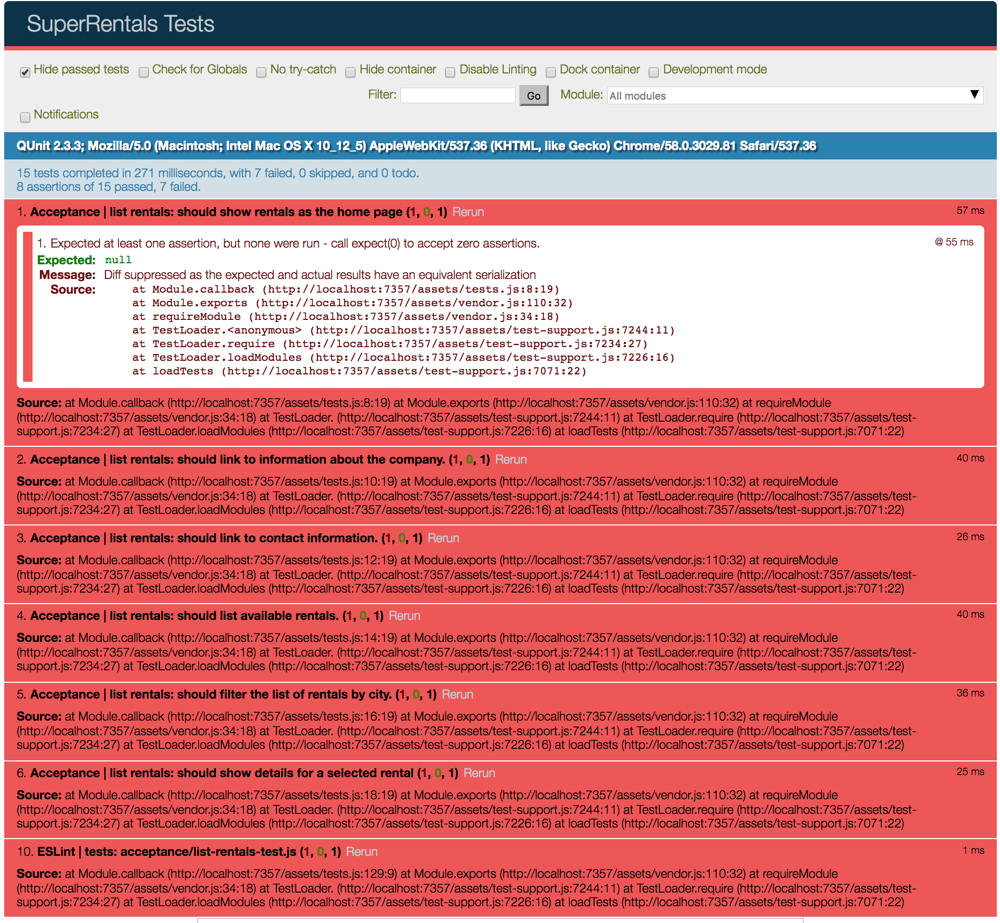

Emberアプリケーションの基本設定を確認するために、Super Rentalsという賃貸物件サイト用のアプリケーションを構築していきましょう。homeページ、aboutページ、contactページの作成から始めていきます。

その前に、私たちが作成したいアプリケーションの外観を以下に示します。


それでは、Super Rentalsアプリケーションのhomeページで何をしたいかを考えてみましょう。

* homeページ上に複数の賃貸物件を表示する
* 会社情報にリンクする
* 問い合わせ情報にリンクする
* 利用可能な賃貸物件を一覧表示する
* 都市ごとに賃貸物件の一覧を絞り込む
* 選択された賃貸物件の詳細を表示する

このページにあることを思い出せるように、Emberにおけるテストについて説明し、アプリケーション実装の一部としてテストを追加する段取りをします。 以降のチュートリアルでは、各ページの最後のセクションで、そのページで実装した機能のテストを追加していく構成となっています。 これらのセクションはアプリケーションを動かすのに必須ではないので、それらを書かなくてもチュートリアルを進めることもできます。

現時点でもう[次のページ](../routes-and-templates/)に進むこともできますし、このままEmberのテストに関する詳細を読み進めることもできます。

### 進むたびにアプリケーションをテストする

これらのゴールを、[EmberのAcceptance tests (受け入れテスト)](../../testing/acceptance/)として表現できます。 受け入れテストは、実際に人が行うように相互作用するだけでなく、それを自動で行えます。そうすることで、アプリケーションが将来にわたって壊れないことを担保できます。

Ember CLI を使って新しいプロジェクトを作成した場合、プロジェクトはJavaScriptテストフレームワークの[`QUnit`](https://qunitjs.com/)を使いテストを定義、実行します。

それでは、Ember CLIを使って、Acceptance tests (受け入れテスト) を作成していきましょう。

```shell
ember g acceptance-test list-rentals
```

コマンドを実行すると、次の内容が出力されます。そして、`tests/acceptance/list-rentals-test.js`というファイルが1つ作成されます。.

```shell
installing acceptance-test
  create tests/acceptance/list-rentals-test.js
```

テストファイルの中身は、`list-rentals` ルートに移動して、そのルートが読み読まれることを確認する定型コードとなっています。 この定型コードは、最初の受け入れテストを書く足がかりになります。

まだアプリケーションになんの機能も追加していないので、この最初のテストを使用して、アプリケーションでテストを実行するようにします。

そのためには、生成されたテスト中で`/list-rentals`と出てくる箇所を`/`に置き換えてください。 テストはベースURLである`http://localhost:4200/`から開始し、ページの読み込みが終わったかどうかと期待するURLかどうかの、基本的なチェックを行います。

```/tests/acceptance/list-rentals-test.js{-6,+7,-8,+9,-12,+13}
import { test } from 'qunit';
import moduleForAcceptance from 'super-rentals/tests/helpers/module-for-acceptance';

moduleForAcceptance('Acceptance | list-rentals');

test('visiting /list-rentals', function(assert) {
test('visiting /', function(assert) {
  visit('/list-rentals');
  visit('/');

  andThen(function() {
    assert.equal(currentURL(), '/list-rentals');
    assert.equal(currentURL(), '/');
  });
});
```

以下は、この簡単なテストについての注意事項です。

* 受け入れテストは`moduleForAcceptance`関数を呼び出すことでセットアップされます。この関数は、各テストごとにEmberアプリケーションを開始して終了することを確認します。
* QUnitは[`assert`](https://api.qunitjs.com/category/assert/)と呼ばれるオブジェクトをそれぞれのテスト関数に渡します。 `assert`は、`equal()`といった、テスト環境内の条件をテストできる関数を持ちます。 テストは成功するアサートを必ず1つは持つ必要があります。
* Emberの受け入れテストは、上記で使われている`visit`、`andThen`、`currentURL`などのような、テストヘルパー関数の集合を使用します。 チュートリアルの後半で、これらの関数の詳細を説明します。

では、CLIコマンド`ember test --server`を使ってテストスイートを実行しましょう。.

`ember test --server`を実行すると、Ember CLIはデフォルトでは[Testemテストランナー](https://github.com/testem/testem)を走らせ、Chromeと[PhantomJS](http://phantomjs.org/)でQunitを走らせます。.

今は起動されたChromeに10個のテストに成功したと表示しているでしょう。 もし"Hide passed tests" (通ったテストを非表示にする) ラベルのチェックボックスをトグルすると、成功した受け入れテストが9個のESLintのテスト結果とともに確認できるはずです。 Emberは作成したそれぞれのファイルに対して、[ESLint](http://eslint.org/)を使った構文チェック (「リンティング」と呼ばれる) を行います。.



### 受け入れテストとしてアプリケーションのゴールを追加する

前に述べたように、最初のテストでは、すべてが正しく実行されていることが確認されました。 ここでは、そのテストをアプリケーションで処理するタスクのリスト(上で説明したものです) に置き換えてみましょう。

```/tests/acceptance/list-rentals-test.js{+7,+7,+8,+9,+10,+11,+12,+13,+14,+15,+16,+17,+18,+19,+20,+21,+22,-23,-24,-25,-26,-27,-28,-29}
import { test } from 'qunit';
import moduleForAcceptance from 'super-rentals/tests/helpers/module-for-acceptance';

moduleForAcceptance('Acceptance | list-rentals');

test('should show rentals as the home page', function (assert) {
});

test('should link to information about the company.', function (assert) {
});

test('should link to contact information.', function (assert) {
});

test('should list available rentals.', function (assert) {
});

test('should filter the list of rentals by city.', function (assert) {
});

test('should show details for a selected rental', function (assert) {
});
test('visiting /', function(assert) {
  visit('/');

  andThen(function() {
    assert.equal(currentURL(), '/');
  });
});
```

`ember test --server`と実行すると、7つのテストに失敗したと表示されるでしょう。 上記で作成した6つのテストはそれぞれ失敗し、さらにESLintのテストが`assert is defined but never used`と言われて失敗します。 上記のテストが失敗するのは、QUnitが特定の条件 (`assert`として知られる) に対して少なくとも1回のチェックを必要とするためです。).

このチュートリアルを通して、これらの受け入れテストをチェックリストとして使用していきます。すべてのテストが通った時には、私たちは高いレベルの目標を達成するはずです。

