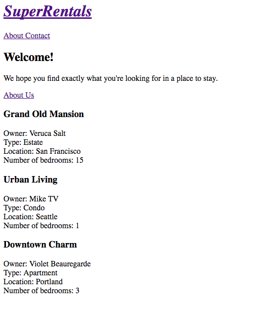
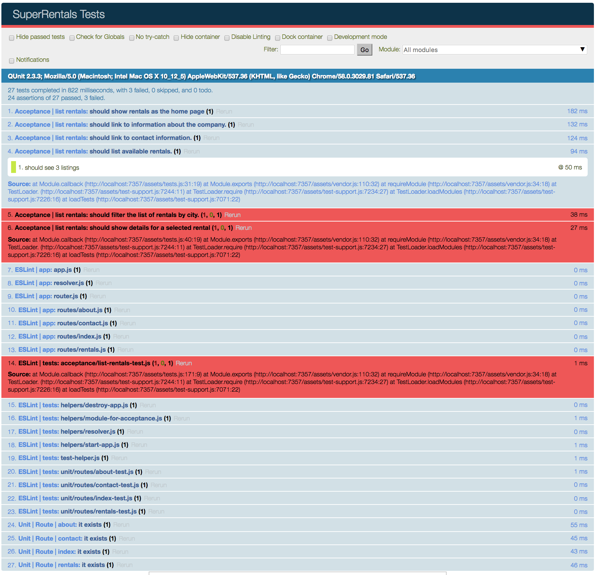

それでは、先ほど作成した賃貸物件ページに利用可能な賃貸物件のリストを追加していきましょう。

Emberは`model`と呼ばれるオブジェクトにページ用のデータを保持します。 まずは物事をシンプルに保つために、賃貸物件一覧ページ用のモデルをハードコードされたJavaScriptオブジェクトの配列を使用して追加しましょう。 その後で、アプリケーション用のデータを永続的に管理するためのライブラリである[Ember Data](https://github.com/emberjs/data)を使うように切り替えます。

完成したホームページは次のようになります。



Emberでは、ルートハンドラーはページ用のデータをモデルに読み込む責務があります。 It loads the data in a function called [`model`](http://emberjs.com/api/classes/Ember.Route.html#method_model). `model`関数は**フック**として振る舞います。これは、アプリケーションとは異なる時間軸でEmberが呼び出すことを意味します。 `rentals`ルートハンドラーに追加したmodel関数は、ユーザーがルートURL`http://localhost:4200`を介してrentalsルートに移動したとき、あるいは`http://localhost:4200/rentals`を介して呼び出されます。.

では`app/routes/rentals.js`を開いて、`model`関数で賃貸物件オブジェクトの配列を返すようにしましょう。

```app/routes/rentals.js{-3,-4,+5,+6,+7,+8,+9,+10,+11,+12,+13,+14,+15,+16,+17,+18,+19,+20,+21,+22,+23,+24,+25,+26,+27,+28,+29,+30,+31,+32,+33,+34,+35,+36,+37,+38} import Ember from 'ember';

export default Ember.Route.extend({ }); export default Ember.Route.extend({ model() { return [{ id: 'grand-old-mansion', title: 'Grand Old Mansion', owner: 'Veruca Salt', city: 'San Francisco', propertyType: 'Estate', bedrooms: 15, image: 'https://upload.wikimedia.org/wikipedia/commons/c/cb/Crane_estate_(5).jpg', description: 'This grand old mansion sits on over 100 acres of rolling hills and dense redwood forests.' }, { id: 'urban-living', title: 'Urban Living', owner: 'Mike TV', city: 'Seattle', propertyType: 'Condo', bedrooms: 1, image: 'https://upload.wikimedia.org/wikipedia/commons/0/0e/Alfonso_13_Highrise_Tegucigalpa.jpg', description: 'A commuters dream. This rental is within walking distance of 2 bus stops and the Metro.'

    }, {
      id: 'downtown-charm',
      title: 'Downtown Charm',
      owner: 'Violet Beauregarde',
      city: 'Portland',
      propertyType: 'Apartment',
      bedrooms: 3,
      image: 'https://upload.wikimedia.org/wikipedia/commons/f/f7/Wheeldon_Apartment_Building_-_Portland_Oregon.jpg',
      description: 'Convenience is at your doorstep with this charming downtown rental. Great restaurants and active night life are within a few feet.'
    
    }];
    

} });

    <br />ここで、ES6の簡略メソッド定義構文の省略表現を使っていることに注意してください。`model()`は`model: function()`と書くのと同じ意味になります。
    
    Ember will use the model object returned above and save it as an attribute called `model`,
    available to the rentals template we generated with our route in [Routes and Templates](../routes-and-templates/#toc_a-rentals-route).
    
    では、賃貸物件ページのテンプレートを見てみましょう。　　
    賃貸物件をリスト表示するためにモデル属性を利用できます。
    ここでは、さらに別の一般的なHandlebarsヘルパー[`{{each}}`](../../templates/displaying-a-list-of-items/) を使います。
    This helper will let us loop through each of the rental objects in our model:
    
    ```app/templates/rentals.hbs{+12,+13,+14,+15,+16,+17,+18,+19,+20,+21,+22,+23,+24,+25,+26,+27,+28,+29}
    <div class="jumbo">
      <div class="right tomster"></div>
      <h2>Welcome!</h2>
      <p>
        We hope you find exactly what you're looking for in a place to stay.
      </p>
      {{#link-to 'about' class="button"}}
        About Us
      {{/link-to}}
    </div>
    
    {{#each model as |rental|}}
      <article class="listing">
        <h3>{{rental.title}}</h3>
        <div class="detail owner">
          <span>Owner:</span> {{rental.owner}}
        </div>
        <div class="detail type">
          <span>Type:</span> {{rental.propertyType}}
        </div>
        <div class="detail location">
          <span>Location:</span> {{rental.city}}
        </div>
        <div class="detail bedrooms">
          <span>Number of bedrooms:</span> {{rental.bedrooms}}
        </div>
      </article>
    {{/each}}
    

このテンプレートでは、各オブジェクトをループします。 各イテレーションでは、取得した現在のオブジェクトを`rental`という変数に格納しています。 変数rentalを参照している各ステップで、その賃貸物件についての情報の一覧を作成します。

You may move onto the [next page](../installing-addons/) to keep implementing new features, or continue reading on testing the app you've created.

### Acceptance Testing the Rental List

To check that rentals are listed with an automated test, we will create a test to visit the index route and check that the results show 3 listings.

In `app/templates/rentals.hbs`, we wrapped each rental display in an `article` element, and gave it a class called `listing`. We will use the listing class to find out how many rentals are shown on the page.

To find the elements that have a class called `listing`, we'll use a test helper called [find](http://emberjs.com/api/classes/Ember.Test.html#method_find). The `find` function returns the elements that match the given [CSS selector](https://developer.mozilla.org/en-US/docs/Web/CSS/CSS_Selectors). In this case it will return an array of all the elements with a class called `listing`.

    /tests/acceptance/list-rentals-test.js{+2,+3,+4,+5}
    test('should list available rentals.', function (assert) {
      visit('/');
      andThen(function() {
        assert.equal(find('.listing').length, 3, 'should see 3 listings');
      });
    });

Run the tests again using the command `ember t -s`, and toggle "Hide passed tests" to show your new passing test.

Now we are listing rentals, and and verifying it with an acceptance test. This leaves us with 2 remaining acceptance test failures (and 1 jshint failure):

